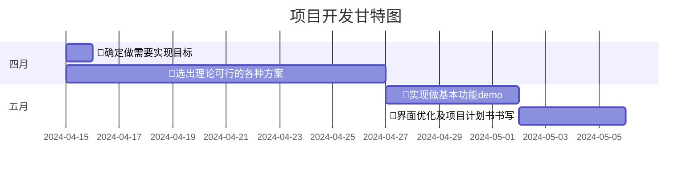

# 内蒙古高考报考一键填报--谷歌浏览器插件
## 项目介绍
- **背景**：内蒙古高考报考实时动态排名存在考生在临近提档时间上不能及时更换志愿的问题。为了解决这一问题，我们开发了这款一键填报插件。
- **简介**：该插件允许考生提前预设志愿，在报考中快速切换志愿，提高报考效率，降低因时间不足而导致的报考风险。
## 项目职责划分
| 职责类别      | 负责人 | 联系方式        | 具体职责                      |
|:----------|:----|:------------|:--------------------------|
| 插件主要功能实现  | 张文博 | 15602032933 | 负责插件的核心功能开发，包括志愿预设、快速切换等。 |
| 界面设计及技术调研 | 李禄凯 | 15139186658 | 负责插件界面设计，提升用户体验，前期技术调研。   |
## 项目预算
- 未提供具体预算，根据项目需求进行合理分配。
## 项目交付物
- 插件源码：包含所有功能实现的代码，方便后续维护和升级。
- [配套说明文档](docs/user_manual.md)：详细描述插件功能、使用方法、注意事项等，方便用户快速上手。
## 项目里程碑

## 项目常用文档
- [项目需求说明书](docs/project_requirements.md)：详细描述项目需求，包括功能、性能、兼容性等方面的要求。
- [测试报告](docs/test_report.md)：记录项目测试过程、测试用例、测试结果等，确保插件质量。
- [用户手册](docs/user_manual.md)：指导用户如何安装、使用插件，解答常见问题。
## 项目前景
随着高考改革的深入推进，考生和家长对报考工作的重视程度逐年提高。我们的插件将为广大内蒙古考生提供便捷、高效的报考工具，帮助他们更好地把握报考机会，实现人生理想。同时，我们也期待这款插件能够在全国范围内推广，为更多考生带来便利。
